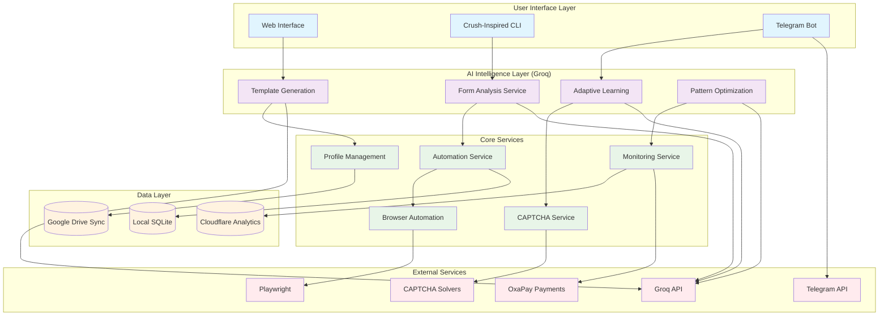
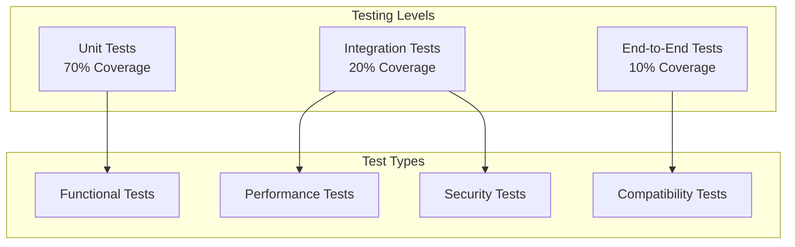

# Design Document

## Overview

The AI Form Filler is a comprehensive automation platform that combines browser automation, artificial intelligence, and multi-interface access to provide intelligent form filling capabilities. The system leverages **Groq for ultra-fast AI inference** and **Charm Bracelet Crush-inspired CLI design patterns** to deliver both cutting-edge intelligence and professional user experience. The architecture consists of two main components: a web interface for profile management and a beautiful CLI tool for automation execution. The platform uses Playwright for browser automation, Groq for real-time AI learning and form analysis, and provides tiered subscription plans with usage-based limitations.

**Key Technology Decisions:**
- **Groq AI**: Ultra-fast inference for real-time form analysis, template generation, and adaptive learning
- **Crush-Inspired CLI**: Professional terminal interface with interactive forms, progress visualization, and elegant user experience
- **Playwright Browser Automation**: Direct browser control without extension dependencies
- **3-Week Development Timeline**: Structured approach with Week 1 (Core System), Week 2 (Intelligence Layer), Week 3 (Launch Ready)

## Architecture

### High-Level Architecture



### Component Communication Flow

1. **User Interaction**: Users interact through Web Interface, CLI, or Telegram Bot
2. **Command Processing**: Commands are processed by the Automation Service
3. **Browser Control**: Playwright handles direct browser automation without extensions
4. **AI Learning**: Forms are analyzed and learned by the AI Learning Service
5. **Profile Management**: Client data is managed through Profile Management Service
6. **CAPTCHA Handling**: CAPTCHAs are processed by the CAPTCHA Service
7. **Data Persistence**: All data is stored locally with optional cloud sync

## Components and Interfaces

### 1. Web Interface

**Technology Stack**: HTML, CSS, JavaScript, served by Go HTTP server

**Core Responsibilities**:
- Profile management and CRUD operations
- Form template visualization and editing
- Execution status monitoring
- User-friendly interface for non-technical users

**Key APIs**:
```typescript
interface WebInterface {
  // Profile management
  createProfile(profileData: ProfileData): Promise<Profile>
  updateProfile(id: string, updates: Partial<ProfileData>): Promise<Profile>
  deleteProfile(id: string): Promise<void>
  
  // Execution control
  startExecution(profileId: string, urls: string[]): Promise<ExecutionSession>
  monitorExecution(sessionId: string): Promise<ExecutionStatus>
  
  // Template management
  viewTemplates(): Promise<FormTemplate[]>
  editTemplate(templateId: string, updates: TemplateUpdates): Promise<FormTemplate>
}
```

### 2. Crush-Inspired CLI Tool

**Technology Stack**: Go with Charm Bracelet libraries (Bubble Tea, Lip Gloss), Playwright integration

**Core Responsibilities**:
- Beautiful interactive terminal interface for profile management
- Real-time progress visualization for parallel executions
- Professional command-line workflows and forms
- System performance monitoring with elegant displays
- Direct browser automation control

**Key Features**:
- Interactive profile creation forms
- Real-time execution dashboard
- Progress bars and status indicators
- Elegant error reporting and recovery flows
- Browser automation without extension dependencies

**Key APIs**:
```go
type CLIInterface struct {
    // Interactive UI components
    ProfileForm    *ProfileFormModel
    Dashboard      *DashboardModel
    ProgressView   *ProgressModel
    StatusDisplay  *StatusModel
    BrowserControl *BrowserControlModel
}

// Core CLI operations
func (cli *CLIInterface) ShowInteractiveProfileForm() (*ClientProfile, error)
func (cli *CLIInterface) DisplayExecutionDashboard(sessions []ExecutionSession) error
func (cli *CLIInterface) ShowProgressVisualization(progress ExecutionProgress) error
func (cli *CLIInterface) HandleUserInteraction(input UserInput) (*Response, error)
func (cli *CLIInterface) ControlBrowserAutomation(commands []BrowserCommand) error
```

**Integration with Groq**:
```go
// CLI displays Groq analysis results beautifully
func (cli *CLIInterface) ShowFormAnalysis(analysis GroqFormAnalysis) error
func (cli *CLIInterface) DisplayLearningProgress(metrics GroqLearningMetrics) error
func (cli *CLIInterface) ShowTemplateGeneration(template GroqTemplate) error
```

### 3. Browser Automation Service

**Technology Stack**: Go with Playwright integration

**Core Responsibilities**:
- Direct browser control and form interaction
- Form field detection and analysis
- Parallel browser session management
- Screenshot and error capture

**Key APIs**:
```go
type BrowserAutomation struct {
    playwright *playwright.Playwright
    browsers   map[string]*playwright.Browser
    contexts   map[string]*playwright.BrowserContext
}

// Browser control
func (ba *BrowserAutomation) LaunchBrowser(browserType string) (*playwright.Browser, error)
func (ba *BrowserAutomation) CreateContext(browser *playwright.Browser) (*playwright.BrowserContext, error)
func (ba *BrowserAutomation) NavigateToPage(context *playwright.BrowserContext, url string) (*playwright.Page, error)

// Form interaction
func (ba *BrowserAutomation) FillForm(page *playwright.Page, profileData ProfileData, template FormTemplate) (*FillResult, error)
func (ba *BrowserAutomation) DetectFormFields(page *playwright.Page) ([]FormField, error)
func (ba *BrowserAutomation) AnalyzeFormStructure(page *playwright.Page) (*FormAnalysis, error)

// Session management
func (ba *BrowserAutomation) ManageParallelSessions(sessions []ExecutionSession) error
func (ba *BrowserAutomation) CleanupResources() error
```

### 4. Telegram Bot

**Technology Stack**: Node.js with Telegraf/Python with python-telegram-bot

**Core Responsibilities**:
- Remote command interface
- Status monitoring and reporting
- User support and error reporting
- Execution control and scheduling

**Key APIs**:
```typescript
interface TelegramBot {
  // Command handling
  handleStartCommand(chatId: number): Promise<void>
  handleExecuteCommand(chatId: number, params: ExecutionParams): Promise<void>
  handleStatusCommand(chatId: number): Promise<void>
  
  // Communication
  sendToCLI(command: RemoteCommand): Promise<void>
  reportExecutionStatus(chatId: number, status: ExecutionStatus): Promise<void>
  
  // User management
  authenticateUser(chatId: number, token: string): Promise<boolean>
  checkUserPermissions(chatId: number, action: string): Promise<boolean>
}
```

### 5. AI Learning Service

**Technology Stack**: Python/Node.js, Machine Learning libraries, Web scraping tools

**Core Responsibilities**:
- Form structure analysis and field detection
- Template generation and optimization
- Self-improvement based on failure analysis
- Pattern recognition for form variations

**Key APIs**:
```typescript
interface AILearningService {
  // Learning operations
  analyzeFormStructure(url: string): Promise<FormAnalysis>
  generateFormTemplate(analysis: FormAnalysis): Promise<FormTemplate>
  improveTemplate(template: FormTemplate, failures: FailureReport[]): Promise<FormTemplate>
  
  // Pattern recognition
  detectFormFields(html: string): Promise<FormField[]>
  identifyFormType(structure: FormStructure): FormType
  
  // Self-improvement
  learnFromFailures(failures: FailureReport[]): Promise<void>
  updateTemplateDatabase(improvements: TemplateImprovement[]): Promise<void>
}

interface FormAnalysis {
  url: string
  formElements: HTMLElement[]
  fieldMappings: FieldMapping[]
  validationPatterns: ValidationPattern[]
  submitMechanisms: SubmitMechanism[]
}
```

## Data Models

### Core Data Structures

```typescript
// User and Profile Management
interface User {
  id: string
  email: string
  subscriptionTier: 'solo' | 'pair' | 'squad'
  deviceCount: number
  dailyExecutions: number
  apiKeys: APIKeySet
  createdAt: Date
  lastActive: Date
}

interface ClientProfile {
  id: string
  userId: string
  name: string
  personalData: PersonalData
  preferences: ProfilePreferences
  createdAt: Date
  updatedAt: Date
}

interface PersonalData {
  firstName: string
  lastName: string
  email: string
  phone: string
  address: Address
  dateOfBirth: Date
  customFields: Record<string, any>
}

// Form and Template Management
interface FormTemplate {
  id: string
  url: string
  domain: string
  formType: FormType
  fields: FormField[]
  selectors: SelectorMap
  validationRules: ValidationRule[]
  successRate: number
  lastUpdated: Date
  version: number
}

interface FormField {
  id: string
  name: string
  type: FieldType
  selector: string
  label: string
  required: boolean
  validationPattern?: string
  defaultValue?: string
}

// Execution and Results
interface ExecutionSession {
  id: string
  userId: string
  profileId: string
  urls: string[]
  status: ExecutionStatus
  startTime: Date
  endTime?: Date
  results: ExecutionResult[]
  errors: ErrorLog[]
}

interface ExecutionResult {
  url: string
  status: 'success' | 'failure' | 'partial'
  filledFields: number
  totalFields: number
  executionTime: number
  errorMessage?: string
  screenshotPath?: string
}

// AI Learning and Improvement
interface LearningSession {
  id: string
  url: string
  templateId: string
  analysisData: FormAnalysis
  improvements: TemplateImprovement[]
  successRate: number
  createdAt: Date
}

interface TemplateImprovement {
  templateId: string
  improvementType: ImprovementType
  oldValue: any
  newValue: any
  confidence: number
  appliedAt: Date
}
```

### Database Schema

```sql
-- Users and Subscriptions
CREATE TABLE users (
  id UUID PRIMARY KEY,
  email VARCHAR(255) UNIQUE NOT NULL,
  subscription_tier VARCHAR(20) NOT NULL,
  device_count INTEGER DEFAULT 0,
  daily_executions INTEGER DEFAULT 0,
  api_keys JSONB,
  created_at TIMESTAMP DEFAULT NOW(),
  last_active TIMESTAMP DEFAULT NOW()
);

-- Client Profiles
CREATE TABLE client_profiles (
  id UUID PRIMARY KEY,
  user_id UUID REFERENCES users(id),
  name VARCHAR(255) NOT NULL,
  personal_data JSONB NOT NULL,
  preferences JSONB,
  created_at TIMESTAMP DEFAULT NOW(),
  updated_at TIMESTAMP DEFAULT NOW()
);

-- Form Templates
CREATE TABLE form_templates (
  id UUID PRIMARY KEY,
  url VARCHAR(500) NOT NULL,
  domain VARCHAR(255) NOT NULL,
  form_type VARCHAR(50) NOT NULL,
  fields JSONB NOT NULL,
  selectors JSONB NOT NULL,
  validation_rules JSONB,
  success_rate DECIMAL(5,2) DEFAULT 0.00,
  last_updated TIMESTAMP DEFAULT NOW(),
  version INTEGER DEFAULT 1
);

-- Execution Sessions
CREATE TABLE execution_sessions (
  id UUID PRIMARY KEY,
  user_id UUID REFERENCES users(id),
  profile_id UUID REFERENCES client_profiles(id),
  urls TEXT[] NOT NULL,
  status VARCHAR(20) NOT NULL,
  start_time TIMESTAMP DEFAULT NOW(),
  end_time TIMESTAMP,
  results JSONB,
  errors JSONB
);

-- Learning Data
CREATE TABLE learning_sessions (
  id UUID PRIMARY KEY,
  url VARCHAR(500) NOT NULL,
  template_id UUID REFERENCES form_templates(id),
  analysis_data JSONB NOT NULL,
  improvements JSONB,
  success_rate DECIMAL(5,2),
  created_at TIMESTAMP DEFAULT NOW()
);
```

## Error Handling

### Error Classification System

```typescript
enum ErrorType {
  NETWORK_ERROR = 'network_error',
  FORM_NOT_FOUND = 'form_not_found',
  FIELD_NOT_FOUND = 'field_not_found',
  VALIDATION_FAILED = 'validation_failed',
  CAPTCHA_FAILED = 'captcha_failed',
  TIMEOUT_ERROR = 'timeout_error',
  RATE_LIMIT_EXCEEDED = 'rate_limit_exceeded',
  AUTHENTICATION_FAILED = 'authentication_failed',
  SYSTEM_RESOURCE_ERROR = 'system_resource_error',
  BROWSER_AUTOMATION_ERROR = 'browser_automation_error'
}

interface ErrorHandler {
  handleError(error: FormFillingError): Promise<ErrorResolution>
  logError(error: FormFillingError): Promise<void>
  triggerSelfImprovement(error: FormFillingError): Promise<void>
  notifyUser(error: FormFillingError): Promise<void>
}
```

### Recovery Strategies

1. **Automatic Retry**: Implement exponential backoff for transient errors
2. **Template Regeneration**: Trigger AI relearning for form structure changes
3. **Fallback Mechanisms**: Use alternative selectors or form detection methods
4. **Browser Recovery**: Restart browser sessions on automation failures
5. **User Notification**: Provide clear error messages and suggested actions
6. **Self-Improvement**: Feed errors into AI learning system for future prevention

## Testing Strategy

### Testing Pyramid



### Test Categories

#### 1. Unit Tests
- **AI Learning Service**: Form analysis algorithms, template generation
- **Profile Management**: Data validation, encryption/decryption
- **CAPTCHA Service**: Solver integration, fallback mechanisms
- **Automation Service**: Browser control, parallel execution

#### 2. Integration Tests
- **Component Communication**: Web Interface ↔ CLI ↔ Telegram Bot
- **Database Operations**: CRUD operations, data consistency
- **External API Integration**: CAPTCHA solvers, Google Drive sync
- **Browser Automation**: Playwright integration with form filling
- **Error Handling**: Error propagation and recovery

#### 3. End-to-End Tests
- **Complete User Workflows**: Profile Creation → Form Analysis → Form Filling
- **Multi-Browser Compatibility**: Chrome, Firefox, Edge testing via Playwright
- **Performance Under Load**: Parallel execution stress testing
- **Real-World Form Testing**: Popular websites and form types

#### 4. Specialized Testing

**Performance Testing**:
- Concurrent browser instance limits
- Memory usage optimization
- Response time benchmarks
- Resource cleanup verification

**Security Testing**:
- Data encryption validation
- API key protection
- User authentication flows
- Input sanitization

**Compatibility Testing**:
- Browser version compatibility
- Operating system support
- Form structure variations
- Website change resilience

### Test Data Management

```typescript
interface TestDataManager {
  // Test form creation
  createTestForm(formType: FormType): Promise<TestForm>
  generateTestProfile(profileType: ProfileType): Promise<ClientProfile>
  
  // Mock services
  mockCaptchaSolver(success: boolean): CaptchaSolver
  mockTelegramAPI(): TelegramAPI
  mockPlaywrightBrowser(): PlaywrightBrowser
  
  // Test environment
  setupTestBrowser(): Promise<Browser>
  cleanupTestData(): Promise<void>
}
```

### Continuous Integration Pipeline

1. **Code Quality Checks**: ESLint, Prettier, TypeScript compilation, Go fmt/vet
2. **Unit Test Execution**: Jest/Mocha for JS/TS, Go test for Go code
3. **Integration Testing**: Docker-based test environment with Playwright
4. **Security Scanning**: Dependency vulnerability checks
5. **Performance Benchmarking**: Automated performance regression testing
6. **Browser Compatibility**: Cross-browser automated testing via Playwright
7. **Deployment Validation**: Staging environment verification

This design provides a robust, scalable architecture that addresses all the requirements while maintaining simplicity through the removal of Chrome extension complexity. The direct browser automation approach using Playwright provides better reliability and easier maintenance.